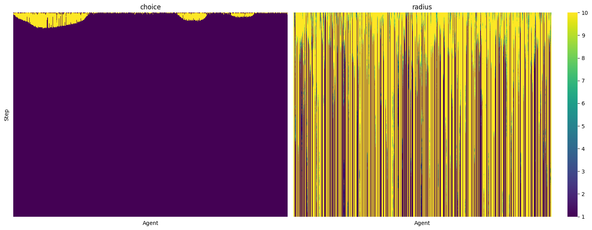
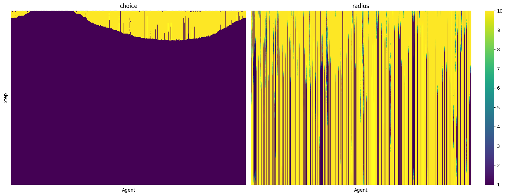
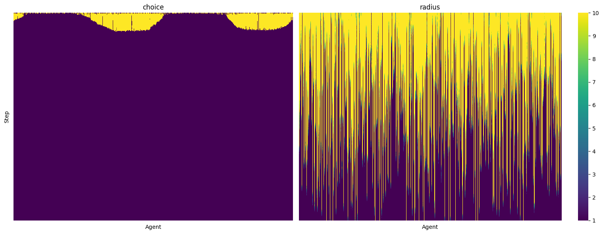
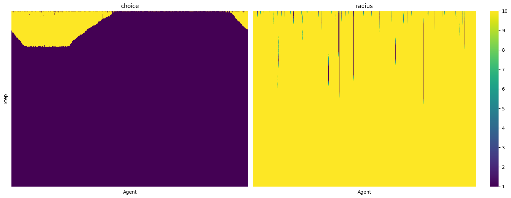

## MULTI-AGENT SYSTEMS
### Mandate 2
### Done by: IMT2019525 VIJAY JAISANKAR

---

### Introduction

In [our mandate](https://docs.google.com/presentation/d/1fhv1yf9R79S0i3avlqUULJgQshlLvxtktaLH-gvPWzU/edit?usp=sharing), we discussed  about rational choice theory, advertising, and neuromarketing.  

Here are the key points pertinent to this extension of the mandate:
- There are three main facets though which advertisements can use consumers' rationality
    - **Assist** consumers in making rational calculations through value communication
    - **Discover** spending habits by modelling consumers as rational agents
    - **modify** the consumers’ valuations through market manipulation
- Advertisers also exploit consumers' behaviour when they deviate from classical rational choice theory. In particular, we discussed
    - **Bounded Rationality** - *satisficing* behaviour
    - **Cognitive dissonance** - as a *sticking mechanism*
    - **Prospect theory** - showcasing *hashmaps* in the face of risk

---

### Influencers
With the explosion of social media, `influencers` have emerged as a great asset to advertisers. [Sprout social](https://sproutsocial.com/glossary/influencer/) defines as influencer as `someone in your niche or industry with sway over your target audience. Influencers have specialized knowledge, authority or insight into a specific subject. Their pre-existing presence in a niche makes them a useful launching pad for brands in search of credibility`. Although influencer-based marketing has been around for a long time, [new niches and genres](https://www.virtualhumans.org/article/online-personas-and-why-people-love-virtual-influencers) of influencers have emerged owing to the rise of social media and its power in manipulating consumers' decision making.   

There is a lot of interesting work on identifying social media influencers (like the [work done by Harrigan, et al.](https://www.sciencedirect.com/science/article/abs/pii/S0268401220314456)), but in this mandate, we will look at this phenomenon at a more abstract level - by **Qualitatively measuring their influence through agent-based modelling**.

---

### Modelling the scenario
We model agents as points on a circular grid, having the following properties:
- Radius of influence: other agents look for what their neighbours (inside their radius) have and choose the majority
- Choice: Between two products, the influencer plans to shift some market share into product 2.
- Tendency: This represents the agent's tendency to get "swayed" by the market, we modelled this as the condition checked to increase or decrease the radius of influence

---

### Code
The code for this simulation builds on top of [Austin Rochford](https://austinrochford.com/posts/thoughtless-python-mesa.html)'s work. 
The simulations were run using the [mesa](https://github.com/projectmesa/mesa) library in python, and can be found [here](https://github.com/vijay-jaisankar/mas-mandates/tree/main/mandate-2).

---

## Experiments
**We ran all simulations with 750 agents for 250 steps.**

### Experiment 1
In this experiment, we set constant random tendencies and radii of influence (max 50). 

We can see that product 2 (yellow) has some market share and the relative radius values are spread out randomly from 1 to 10.

### Experiment 2
In this experiment, we increased the max radius of an agent to 100 and increased the tendencies of an agent by `1.005x` at every relevant step. In the real world, this represents their increased exposure to target online advertisements and approximates the effects of [echo chambers](https://viscapmedia.com/news/social-media-echo-chambers-in-marketing/).

We can see that the radius values have increased from experiment 1, and there are clusters of agents choosing product 2.

### Experiment 3
In this experiment, we keep the same max radius value, but look at the flipside of the effects - increased awareness about advertising tacts over time lead to a decay of tendencies by `0.99x` at every relevant stap. In the real world, this represents the increased usage of [ad blockers](https://backlinko.com/ad-blockers-users).

We can see the stark contrast between `radius` values between those of experiment 3 and the earlier experiment 2. Also, clusters of "gullible" agents have emerged who influence others in their small circles.

### Experiment 4
In this experiment, we emulate the effects of a famous influencer by increasing the initial tendency values by `1.5x` and setting a boost of `1.05x` at every relevant time step.

This experiment shows the largest values of market share and radius values. We can also clearly locate the influencer's target audience.